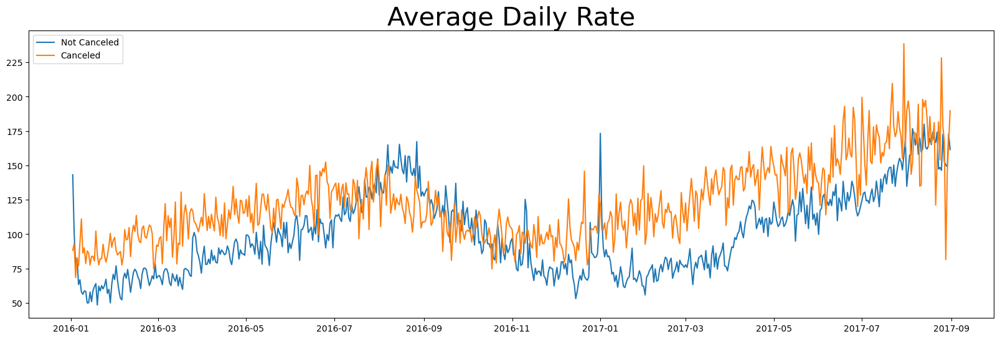
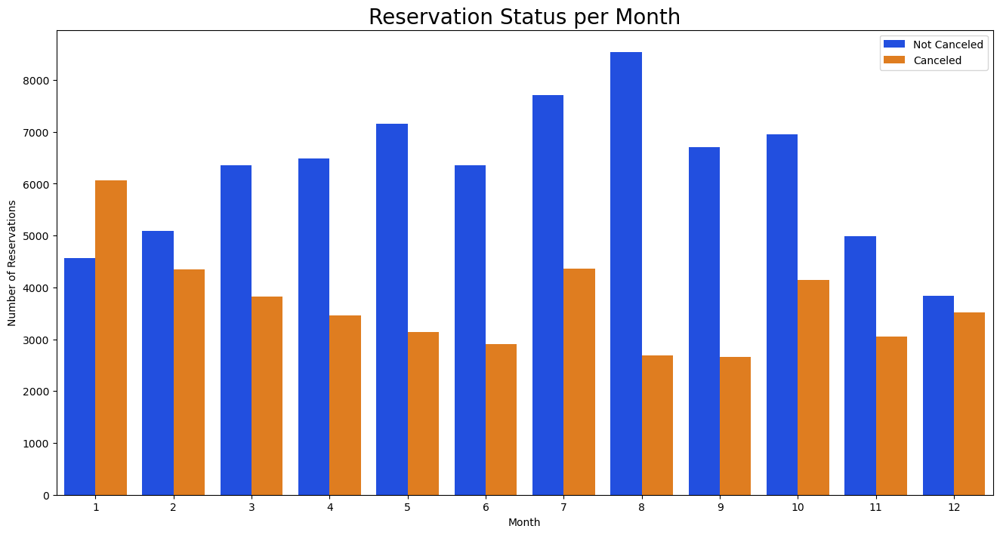

# Hotel Booking Cancellation Analysis and Revenue Optimization

## Project Overview
This project performs exploratory data analysis (EDA) on hotel booking data from 2015 to 2017 to identify key factors driving reservation cancellations. The analysis focuses on pricing behavior, seasonality, booking channels, and hotel type to derive data-driven strategies for improving revenue and room utilization for both city and resort hotels.

## Dataset
- **Source:** Hotel Booking Dataset (2015–2017)
- **Records:** 119,000+ hotel bookings
- **Key Features:**
  - Hotel type (City / Resort)
  - Average Daily Rate (ADR)
  - Booking status (Canceled / Not Canceled)
  - Booking channel
  - Customer country
  - Reservation month and lead time

## Tools & Technologies
- **Programming Language:** Python  
- **Libraries:** Pandas, NumPy, Matplotlib, Seaborn  
- **Environment:** Jupyter Notebook  

## Business Questions Addressed
- What factors influence hotel booking cancellations?
- How do pricing and seasonality affect cancellation behavior?
- Which booking channels and regions contribute most to cancellations?
- How can hotels optimize pricing and promotional strategies to reduce cancellations?

## Analysis Approach
- Data cleaning and preprocessing
- Exploratory data analysis using grouped and time-based visualizations
- Comparative analysis across hotel types, months, pricing, and booking channels
- Insight generation with a focus on business impact

## Key Visualizations

### Average Daily Rate vs Cancellation

### Monthly Cancellation Trend

## Key Insights
- Approximately **37% of hotel bookings are cancelled**, resulting in significant revenue loss
- Higher **Average Daily Rate (ADR)** shows a strong correlation with higher cancellation rates
- **January** experiences the highest number of cancellations, while **August** has the highest confirmed bookings
- **Resort hotels** exhibit a higher cancellation ratio compared to city hotels
- **Online Travel Agencies (OTAs)** contribute the majority of cancellations

## Conclusion
This project demonstrates how exploratory data analysis can uncover meaningful business insights related to hotel booking cancellations. By applying pricing optimization, seasonal promotions, and channel-focused strategies, hotels can reduce cancellations, improve occupancy rates, and enhance overall revenue performance.

## Contact
- **Name:** Tanushri Barsainya  
- **GitHub:** https://github.com/tanushri1506  
- **LinkedIn:** https://www.linkedin.com/in/tanushri1506/

